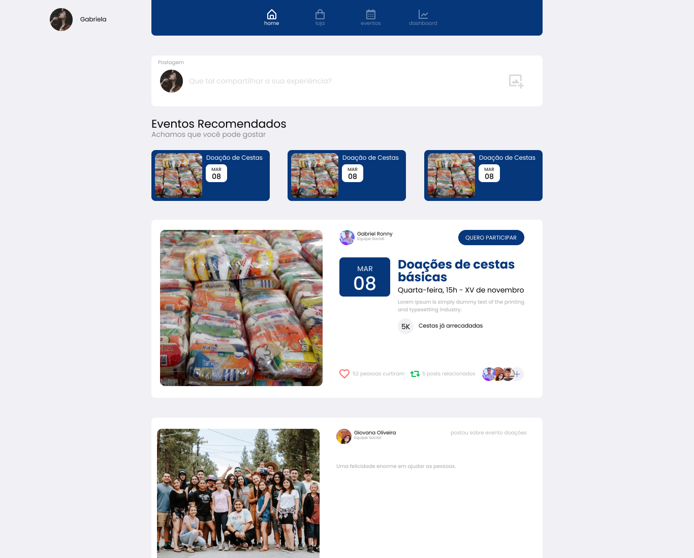
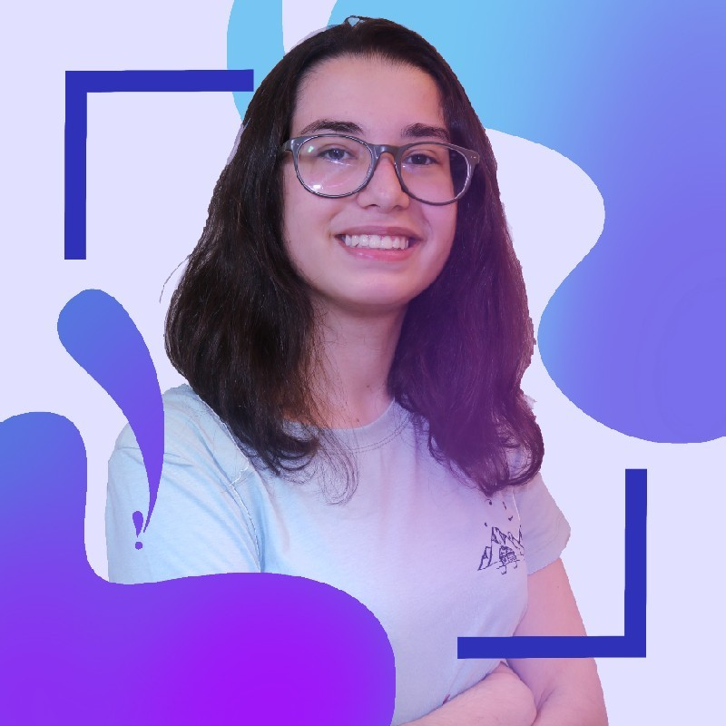
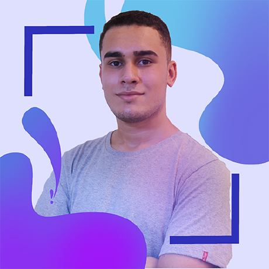

 

  

<!-- ABOUT THE PROJECT -->
## Sobre o projeto

O Volunt3r nasceu através de uma das matérias que temos na nossa faculdade a SPTECH SCHOOL para desenvolvermos as nossas habilidades aprendidas em outras matérias do nosso curso de Ciência da Computação.

Contudo ao escolher o tema para o desenvolvimento do projeto pensamos na empresa que trabalhamos a B3, que possui um projeto muito lindo ajudar a sociedade a B3 Social. 

Em grupo pensamos em como podemos engajar os voluntários da própria empresa a realizarem ações que podem ajudar a sociedade, assim nasceu a plataforma <b>Volunt3r</b> que consiste em compartilhar eventos sociais, realizar publicações de eventos realizados, curtir, comentar e o mais legal de tudo isso para engajar os voluntários criamos uma gameficação, que o voluntário conforme for participando dos eventos, se engajando de fato ele vai ganhando medalhas que são exbidas no seu perfil e também as milhas que são moedas que ele pode comprar cursos dentro da plataforma para melhorar o seu conhecimento profissional.

(<a href="#readme-top">voltar ao topo</a>)

### Tecnologias utilizadas

Para o projeto utilizamos as principais tecnologias que estão sendo utilizadas no mercado

[![React][React.js]][React-url]
[![Java][Java]][Java-url]
[![Python][Python]][Python-url]
[![MySQL][MySQL]][MySQL-url]
[![AWS][AWS]][AWS-url]
[![Azure][Azure]][Azure-url]

### Construido por
<!-- GETTING STARTED -->

<table style="border: none;">
    <tr style="border: none;">
        <td style="border: none;">
             
            Eduardo Cavalcant 
            
            
        </td>
        <td style="border: none;">
             
            Giovanna Oliveira 
            
            
        </td>
        <td style="border: none;">
             
            Gabriel Ronny 
            
            
        </td>
    </tr>
    <tr>
        <td style="border: none;">
             
            Henrique Zigon 
            
            
        </td>
        <td style="border: none;">
             
            Ygor Lima 
            
            
        </td>
    </tr>
</table>

(<a href="#readme-top">voltar ao topo</a>)

<!-- MARKDOWN LINKS & IMAGES -->

[React.js]: https://img.shields.io/badge/React-20232A?style=for-the-badge&logo=react&logoColor=61DAFB
[React-url]: https://reactjs.org/

[AWS]: https://img.shields.io/badge/Amazon_AWS-232F3E?style=for-the-badge&logo=amazon-aws&logoColor=white
[AWS-url]: https://aws.amazon.com/pt/

[Azure]: https://img.shields.io/badge/Microsoft_Azure-0089D6?style=for-the-badge&logo=microsoft-azure&logoColor=white
[Azure-url]: https://portal.azure.com/

[Python]: https://img.shields.io/badge/Python-3776AB?style=for-the-badge&logo=python&logoColor=white
[Python-url]: https://www.python.org/

[Java]: https://img.shields.io/badge/Java-ED8B00?style=for-the-badge&logo=java&logoColor=white
[Java-url]: https://www.java.com/pt-BR/

[MySQL]: https://img.shields.io/badge/MySQL-00000F?style=for-the-badge&logo=mysql&logoColor=white
[MySQL-url]: https://www.mysql.com/

